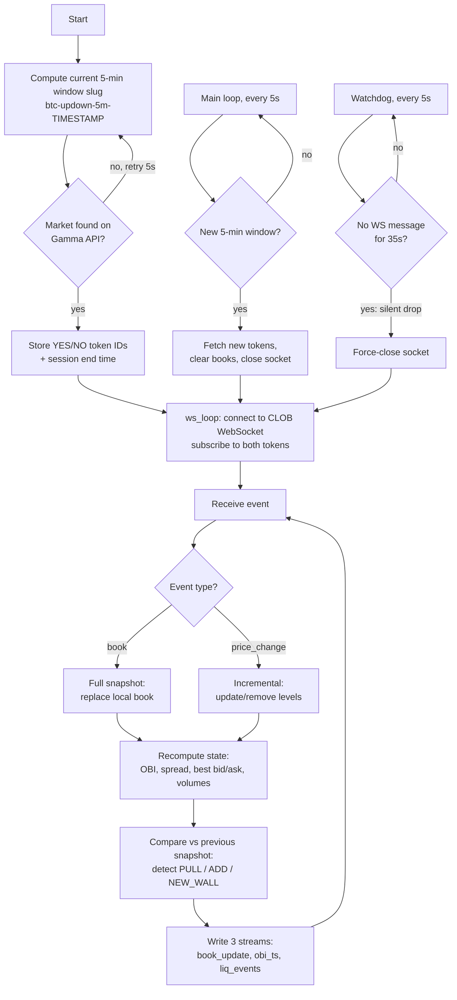

<p align="center">
  
</p>

# bookscope

High-fidelity **orderbook recorder** for Polymarket prediction markets, built for market-microstructure research. It attaches to the rolling BTC 5-minute up/down markets and records every single orderbook event to disk - so you can study market-maker behavior, liquidity dynamics, and signal quality offline, on real data, instead of guessing.

## How it works



Three loops run in parallel: the **event loop** (receive, rebuild book, record), the **main loop** (rolls to the next 5-minute market window), and the **watchdog** (kills silently-dead sockets). All reconnection funnels through one place - `ws_loop()` - with exponential backoff.

## What it records

Four gzipped JSONL streams, rotated hourly under `./poly_data/<date>/`:

| Stream | Contents |
|---|---|
| `book_update` | Full top-10 depth snapshot on every change, with OBI, spread, bid/ask volume |
| `obi_ts` | Compact Order Book Imbalance timeseries (for fast plotting) |
| `liq_events` | Detected liquidity events: PULL (>50% drop at a level), ADD (>100% increase), NEW_WALL |
| `sessions` | Market window boundaries for session-level correlation |

## Why this exists

Prediction-market orderbooks have structural quirks (asymmetric depth, wall placement games by market makers) that make naive signals like raw OBI misleading. The only way to separate signal from noise is a complete, lossless record of the book. This tool produced the datasets behind my own trading-strategy research - findings like depth-level asymmetry generating false imbalance signals came straight from this data.

## Design

- **Lossless capture**: full snapshots (`book`) and incremental updates (`price_change`) are both applied to a local book, and the reconstructed state is recorded on every event
- **Thread-safe**: single lock around book state, per-writer locks for file output
- **Silent-drop detection**: a WebSocket can stay "connected" while the server stops sending - invisible gaps are fatal for a recorder. A single global watchdog tracks message age and force-closes the socket after 35s of silence
- **Single connection owner**: one `ws_loop()` thread owns the socket lifecycle with exponential backoff (max 30s); close handlers never spawn reconnects, which prevents parallel-socket buildup and ping storms across session rollovers
- **Session rollover**: market discovery re-polls every 5s and rolls to the next 5-minute window by closing the socket - the loop reconnects and resubscribes with fresh tokens
- **Bounded footprint**: gzip streaming writers, periodic flush, live dashboard shows disk usage and 24h size projection

## Usage

```bash
pip install -r requirements.txt

python recorder.py                 # record indefinitely (Ctrl+C to stop)
python recorder.py --duration 6    # record for 6 hours
```

The live dashboard prints every 30 seconds: connection state, current OBI both sides, event counts, write rate, and disk usage.

## Data format examples

`book_update`:
```json
{"ts": 1750000000000, "side": "YES", "obi": 0.31, "best_bid": 0.52, "best_ask": 0.54, "spread": 0.02, "bid_vol": 812.0, "ask_vol": 431.5, "book": {"bids": [[0.52, 120.0]], "asks": [[0.54, 95.0]]}}
```

`liq_events`:
```json
{"type": "PULL", "side": "bids", "price": 0.51, "from": 250.0, "to": 40.0, "pct": -0.84, "ts": 1750000000000, "token_side": "YES", "obi_at_event": 0.31}
```

## Notes

- Read-only: this tool never places orders and needs no API key or wallet
- Uses public Polymarket endpoints (Gamma API + CLOB WebSocket)
- Expect roughly hundreds of MB per 24h of continuous recording (the dashboard projects this live)

## License

MIT
